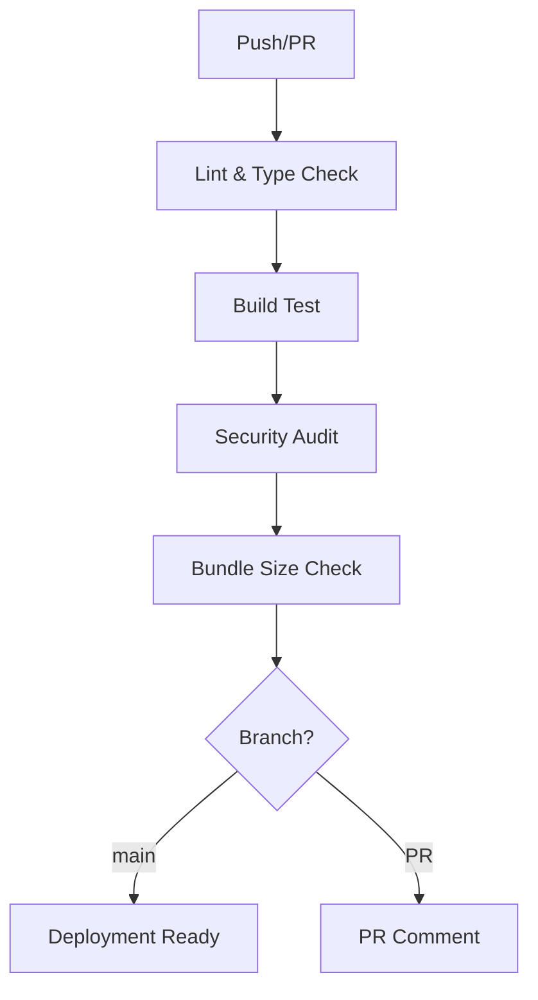
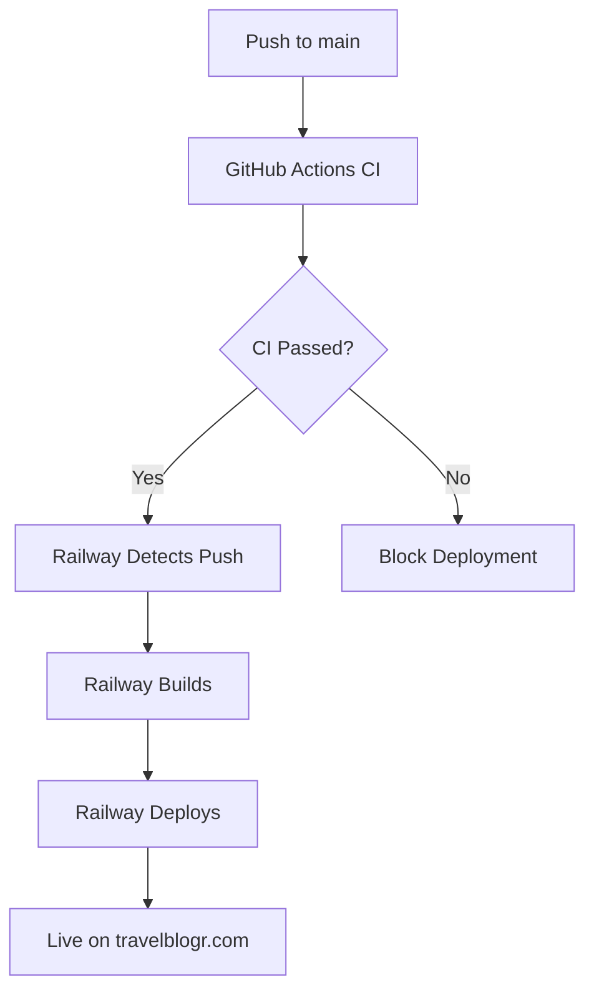
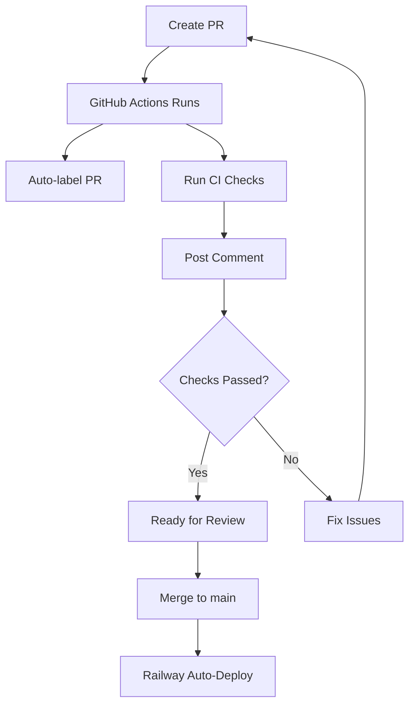

# 🤖 CI/CD Automation Guide

> **Automated testing, building, and deployment workflows for TravelBlogr**

---

## 📋 Table of Contents

1. [Overview](#overview)
2. [GitHub Actions Workflows](#github-actions-workflows)
3. [Railway Auto-Deployment](#railway-auto-deployment)
4. [Setup Instructions](#setup-instructions)
5. [Workflow Details](#workflow-details)
6. [Future Enhancements](#future-enhancements)

---

## Overview

TravelBlogr uses **GitHub Actions** for CI/CD automation and **Railway** for automatic deployments.

### What's Automated?

✅ **Code Quality Checks** - Lint, type-check on every PR  
✅ **Build Testing** - Ensure code builds successfully  
✅ **Security Audits** - Check for vulnerabilities  
✅ **PR Comments** - Automatic status updates on PRs  
✅ **Auto-labeling** - PRs labeled based on changed files  
✅ **Deployment** - Railway auto-deploys on push to main  

---

## GitHub Actions Workflows

### 1. CI Pipeline (`.github/workflows/ci.yml`)

**Triggers:**
- Push to `main` or `develop` branches
- Pull requests to `main` or `develop`

**Jobs:**
1. **Lint & Type Check** - ESLint + TypeScript validation
2. **Build Test** - Verify production build works
3. **Security Audit** - npm audit for vulnerabilities
4. **Dependency Check** - Check for outdated packages
5. **Bundle Size Check** - Monitor bundle sizes
6. **Deployment Ready** - Notification when ready (main only)
7. **PR Comment** - Status comment on PRs

**Example Output:**
```
✅ Lint check passed
✅ Type check passed
✅ Build successful
✅ Security audit completed
```

### 2. Railway Deployment (`.github/workflows/deploy-railway.yml`)

**Triggers:**
- Push to `main` branch
- Manual trigger via GitHub Actions UI

**Jobs:**
1. **Pre-deployment Checks** - Type-check + Lint
2. **Build Test** - Verify build works
3. **Deployment Notification** - Log deployment info
4. **Post-deployment Checklist** - Reminder to verify

**Note:** Railway handles actual deployment automatically. This workflow just validates before Railway deploys.

### 3. PR Preview (`.github/workflows/pr-preview.yml`)

**Triggers:**
- PR opened, updated, or reopened

**Jobs:**
1. **PR Information** - Display PR details
2. **Changed Files Analysis** - Count changes by type
3. **Build & Test** - Full CI checks
4. **Security Check** - Vulnerability scan
5. **PR Comment** - Detailed status update
6. **Auto-labeling** - Add labels based on changes

**Example PR Comment:**
```markdown
## 🤖 PR Preview Check Results

✅ Build & Tests: success
✅ Security Audit: success

### 📊 Details
- Type Check: Passed
- Lint: Passed
- Build: Passed
- Security: No high-severity issues

### 🚀 Next Steps
- ✅ Ready for review
- ✅ Can be merged after approval
```

---

## Railway Auto-Deployment

### How It Works

1. **Push to main** → Railway detects change
2. **Railway builds** → Runs `npm run build`
3. **Railway deploys** → Starts with `npm start`
4. **Live in ~3 minutes** → https://www.travelblogr.com

### Configuration

**Railway watches:**
- Repository: `rhymeas/TravelBlogr`
- Branch: `main` (or configured branch)
- Build Command: `npm run build`
- Start Command: `npm start`

**Environment Variables:**
- Set in Railway Dashboard → Variables tab
- `NEXT_PUBLIC_*` vars baked into build
- Server vars available at runtime

---

## Setup Instructions

### 1. Enable GitHub Actions

**Already enabled!** Workflows are in `.github/workflows/`

To verify:
1. Go to GitHub → Your repo → "Actions" tab
2. You should see workflows listed
3. They run automatically on push/PR

### 2. Configure Railway

**Already configured!** Railway auto-deploys from GitHub.

To verify:
1. Railway Dashboard → Your service
2. Settings → Source → Should show GitHub connection
3. Settings → Source → Branch should be `main`

### 3. Add GitHub Secrets (Optional)

For advanced features, add these secrets:

**GitHub → Settings → Secrets and variables → Actions:**

```bash
# Optional: Railway CLI token for manual deployments
RAILWAY_TOKEN=your_railway_token_here

# Optional: Slack webhook for notifications
SLACK_WEBHOOK_URL=https://hooks.slack.com/...

# Optional: Discord webhook for notifications
DISCORD_WEBHOOK_URL=https://discord.com/api/webhooks/...
```

### 4. Create GitHub Labels (Optional)

For auto-labeling to work, create these labels:

```bash
documentation - 📚 Documentation changes
ui - 🎨 UI/Component changes
backend - ⚙️ Backend/API changes
deployment - 🚀 Deployment changes
dependencies - 📦 Dependency updates
```

**Create via GitHub UI:**
1. Go to Issues → Labels
2. Click "New label"
3. Add each label with color

---

## Workflow Details

### CI Pipeline Flow



### Deployment Flow



### PR Review Flow



---

## Monitoring & Notifications

### GitHub Actions

**View workflow runs:**
1. GitHub → Actions tab
2. Click on workflow name
3. View logs for each job

**Get notifications:**
- GitHub sends email on workflow failures
- Configure in GitHub → Settings → Notifications

### Railway

**View deployments:**
1. Railway Dashboard → Deployments tab
2. Click deployment → View logs
3. Monitor build and deploy logs

**Get notifications:**
- Railway sends email on deploy success/failure
- Configure in Railway → Settings → Notifications

---

## Future Enhancements

### Phase 1: Testing (Recommended)
- [ ] Add unit tests with Jest
- [ ] Add integration tests
- [ ] Add E2E tests with Playwright
- [ ] Test coverage reporting

### Phase 2: Advanced CI/CD
- [ ] Automated dependency updates (Dependabot)
- [ ] Automated changelog generation
- [ ] Semantic versioning automation
- [ ] Performance regression testing

### Phase 3: Monitoring
- [ ] Error tracking (Sentry integration)
- [ ] Performance monitoring (Vercel Analytics)
- [ ] Uptime monitoring (UptimeRobot)
- [ ] Log aggregation (Logtail)

### Phase 4: Advanced Deployment
- [ ] Staging environment
- [ ] Canary deployments
- [ ] Blue-green deployments
- [ ] Automated rollback on errors

### Phase 5: Notifications
- [ ] Slack notifications for deployments
- [ ] Discord notifications for PRs
- [ ] Email digests for CI/CD activity
- [ ] Custom webhooks for integrations

---

## Troubleshooting

### Workflow Fails on Lint

**Error:** ESLint errors in code

**Fix:**
```bash
npm run lint
# Fix errors
git add .
git commit -m "fix: lint errors"
git push
```

### Workflow Fails on Type Check

**Error:** TypeScript errors

**Fix:**
```bash
npm run type-check
# Fix type errors
git add .
git commit -m "fix: type errors"
git push
```

### Workflow Fails on Build

**Error:** Build fails

**Fix:**
```bash
npm run build
# Fix build errors
git add .
git commit -m "fix: build errors"
git push
```

### Railway Doesn't Deploy

**Possible causes:**
1. Not pushed to `main` branch
2. Railway watching wrong branch
3. Build failed in Railway

**Fix:**
1. Check Railway → Settings → Source → Branch
2. Check Railway → Deployments → View logs
3. Ensure pushed to correct branch

---

## Best Practices

### 1. Always Create PRs

```bash
# Don't push directly to main
git checkout -b feature/my-feature
# Make changes
git push origin feature/my-feature
# Create PR on GitHub
```

### 2. Wait for CI Before Merging

- ✅ All checks must pass
- ✅ Review PR comments from GitHub Actions
- ✅ Fix any issues before merging

### 3. Monitor Deployments

- ✅ Watch Railway logs after merge
- ✅ Test site after deployment
- ✅ Monitor for errors

### 4. Keep Dependencies Updated

- ✅ Review Dependabot PRs
- ✅ Test dependency updates
- ✅ Merge security updates promptly

---

## Quick Commands

### Trigger CI Manually

```bash
# Push to trigger CI
git commit --allow-empty -m "Trigger CI"
git push
```

### Trigger Deployment Manually

```bash
# In GitHub Actions UI
Actions → Deploy to Railway → Run workflow
```

### Check Workflow Status

```bash
# Via GitHub CLI (if installed)
gh run list
gh run view <run-id>
```

---

## Resources

- **GitHub Actions Docs:** https://docs.github.com/en/actions
- **Railway Docs:** https://docs.railway.app
- **Next.js CI/CD:** https://nextjs.org/docs/deployment
- **Workflow Examples:** https://github.com/actions/starter-workflows

---

**Last Updated:** 2025-10-11  
**Status:** ✅ Active  
**Workflows:** 3 (CI, Deploy, PR Preview)

